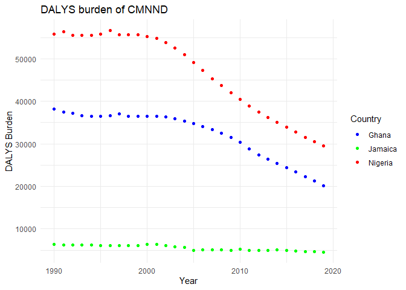
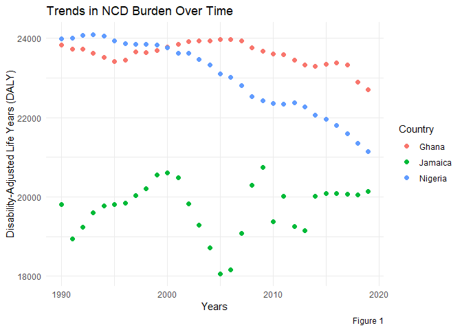
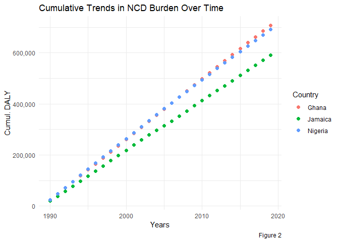
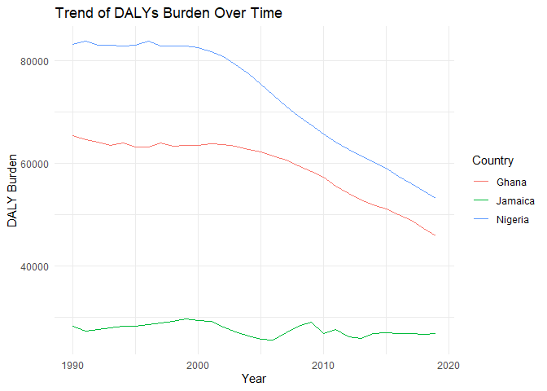
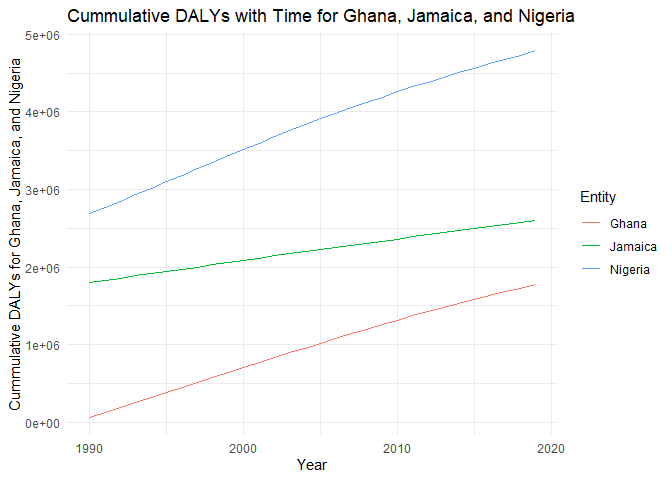

Global Disease Burden Analysis
================
Ifeanyi Okoye, Gbotoso Olaoluwa, Rodrigue

# Introduction

This document compares the Disability-Adjusted Life Year (DALY) diseases
burden for three countries: Nigeria, Ghana, and Jamaica. We compare the
burden due to communicable, maternal, neonatal, and nutritional diseases
(CMNN), non-communicable diseases (NCDs), and overall disease burden for
these countries.

The source data is from the Institute for Health Metrics and Evaluation
(IHME) Global Burden of Disease (GBD) study.

# Communicable, Maternal, Neonatal, and Nutritional Disease Burden (CMNN)

## Table of Estimates for CMNN Burden Over Time

| Year |  Ghana   | Jamaica  | Nigeria  |
|:-----|:--------:|:--------:|:--------:|
| 1990 | 38169.03 | 6331.229 | 55858.01 |
| 1991 | 37543.84 | 6221.363 | 56402.61 |
| 1992 | 37134.43 | 6238.286 | 55584.80 |
| 1993 | 36581.16 | 6198.007 | 55462.25 |
| 1994 | 36468.65 | 6164.118 | 55563.10 |
| 1995 | 36486.44 | 6074.215 | 55778.38 |
| 1996 | 36604.25 | 6041.432 | 56608.97 |
| 1997 | 37106.98 | 6032.453 | 55670.89 |
| 1998 | 36529.98 | 6048.248 | 55633.69 |
| 1999 | 36491.57 | 6140.647 | 55610.97 |
| 2000 | 36511.40 | 6365.520 | 55309.83 |
| 2001 | 36543.17 | 6364.223 | 54828.09 |
| 2002 | 36337.37 | 6091.393 | 53795.58 |
| 2003 | 35934.13 | 5727.125 | 52594.17 |
| 2004 | 35389.60 | 5639.700 | 50933.61 |
| 2005 | 34746.13 | 4930.504 | 49195.49 |
| 2006 | 34048.81 | 5108.989 | 47222.66 |
| 2007 | 33299.14 | 5093.208 | 45320.76 |
| 2008 | 32442.34 | 5116.391 | 43735.33 |
| 2009 | 31470.54 | 4932.286 | 42069.10 |
| 2010 | 30352.22 | 5200.381 | 40429.09 |
| 2011 | 28746.38 | 4963.594 | 38900.83 |
| 2012 | 27367.24 | 4988.099 | 37432.21 |
| 2013 | 26364.20 | 4953.324 | 36186.87 |
| 2014 | 25361.35 | 5041.264 | 35085.94 |
| 2015 | 24430.32 | 4880.094 | 33891.85 |
| 2016 | 23350.04 | 4787.472 | 32791.92 |
| 2017 | 22336.89 | 4709.253 | 31579.39 |
| 2018 | 21254.46 | 4635.571 | 30540.72 |
| 2019 | 20202.91 | 4566.962 | 29467.82 |

DALYS burden of communicable, maternal, neonatal, and nutritional
diseases Over Time for Ghana,Jamaica and Nigeria

## Plot Showing Trends in CMNN Burden Over Time

<!-- -->

## Summary of CMNN Burden Findings

Between 1990 and 2020, the DALYS burden of communicable, maternal,
neonatal, and nutritional (CMNND) diseases over Time in Nigeria is much
higher than in Ghana and Jamaica. Even though staying at a very low
rate, the decline in the burden of CMNND in Jamaica is very slow over
time, while in Nigeria and Ghana we see a significant decline over time
during the same period.

# Non-Communicable Disease Burden (NCD)

## Table of Estimates for NCD Burden Over Time

| Year | Ghana | Jamaica | Nigeria |
|:-----|:-----:|:-------:|:-------:|
| 1990 | 23835 |  19810  |  23994  |
| 1991 | 23739 |  18940  |  24006  |
| 1992 | 23729 |  19241  |  24073  |
| 1993 | 23628 |  19607  |  24103  |
| 1994 | 23518 |  19770  |  24068  |
| 1995 | 23415 |  19815  |  23947  |
| 1996 | 23449 |  19837  |  23875  |
| 1997 | 23668 |  20026  |  23852  |
| 1998 | 23649 |  20207  |  23845  |
| 1999 | 23703 |  20562  |  23833  |
| 2000 | 23789 |  20609  |  23764  |
| 2001 | 23861 |  20487  |  23631  |
| 2002 | 23917 |  19821  |  23630  |
| 2003 | 23934 |  19281  |  23473  |
| 2004 | 23934 |  18708  |  23329  |
| 2005 | 23968 |  18050  |  23102  |
| 2006 | 23982 |  18155  |  23017  |
| 2007 | 23947 |  19080  |  22813  |
| 2008 | 23758 |  20295  |  22529  |
| 2009 | 23677 |  20745  |  22436  |
| 2010 | 23609 |  19371  |  22361  |
| 2011 | 23597 |  20013  |  22343  |
| 2012 | 23461 |  19249  |  22377  |
| 2013 | 23332 |  19155  |  22276  |
| 2014 | 23297 |  20024  |  22064  |
| 2015 | 23349 |  20090  |  21964  |
| 2016 | 23380 |  20087  |  21802  |
| 2017 | 23324 |  20068  |  21595  |
| 2018 | 22906 |  20053  |  21351  |
| 2019 | 22703 |  20140  |  21142  |

Table of Estimates for NCD Burden Over Time

## Plot Showing Trends in NCD Burden Over Time

<!-- -->

## Summary of NCD Burden Findings

In the 30-year period shown in Figure 1 above, the burden of
Non-Communicable Diseases (NCDs) continues to drop at a very low rate
for Nigeria and Ghana. While Jamaica may not have comparative levels of
NCDs with Nigeria and Ghana, a precipitous drop in the 5-year period
between 2000 and 2005 only led to a similar rate of increase over the
next five years to 2010, where it has since plateaued. Given that the
data is looking at NCDs, it may be difficult to adduce a reason for the
increase.

### Cumulative DALY Burden for NCDs

<!-- -->

The cumulative trends show that the burden of NCDs in the three
countries has grown exponentially over the 30 years covered in the
analysis. The trends in Ghana and Nigeria are similar, with just a
slight difference from Jamaica.

# Overall Disease Burden

## Table of Estimates for Overall Disease Burden Over Time

| Year |  Ghana   | Jamaica  | Nigeria  |
|:-----|:--------:|:--------:|:--------:|
| 1990 | 65403.59 | 28251.64 | 83225.66 |
| 1991 | 64671.89 | 27280.65 | 83782.38 |
| 1992 | 64200.04 | 27673.16 | 83103.23 |
| 1993 | 63507.64 | 27992.20 | 82991.49 |
| 1994 | 63989.91 | 28216.13 | 82969.94 |
| 1995 | 63252.55 | 28340.13 | 83026.21 |
| 1996 | 63277.94 | 28558.35 | 83770.22 |
| 1997 | 64038.00 | 28950.34 | 82829.75 |
| 1998 | 63422.87 | 29192.07 | 82842.87 |
| 1999 | 63481.72 | 29703.75 | 82873.98 |
| 2000 | 63569.57 | 29406.67 | 82601.23 |
| 2001 | 63813.70 | 29267.74 | 81850.25 |
| 2002 | 63646.88 | 28144.78 | 80780.64 |
| 2003 | 63290.82 | 27099.04 | 79278.81 |
| 2004 | 62780.86 | 26443.54 | 77540.38 |
| 2005 | 62204.93 | 25664.87 | 75379.06 |
| 2006 | 61533.66 | 25630.19 | 73330.45 |
| 2007 | 60739.70 | 26952.87 | 71176.37 |
| 2008 | 59592.35 | 28307.06 | 69242.37 |
| 2009 | 58495.99 | 29070.21 | 67483.05 |
| 2010 | 57274.76 | 26913.96 | 65739.92 |
| 2011 | 55630.43 | 27578.32 | 64174.38 |
| 2012 | 54077.98 | 26171.45 | 62740.79 |
| 2013 | 52929.39 | 25935.69 | 61468.45 |
| 2014 | 51901.16 | 26897.24 | 60410.35 |
| 2015 | 51084.94 | 26945.50 | 59034.54 |
| 2016 | 50030.63 | 26891.58 | 57477.91 |
| 2017 | 48932.66 | 26814.11 | 56018.08 |
| 2018 | 47288.63 | 26734.37 | 54681.25 |
| 2019 | 45965.32 | 26815.96 | 53229.60 |

DALYs Burden for Ghana, Jamaica. and Nigeria

## Plot Showing Trends in Overall Disease Burden Over Time

<!-- -->

## Summary of Overall Disease Burden Findings

The burden of DALYs remained stable for Nigeria and Ghana throughout the
decade spanning from 1990 to 2000, before gradually declining until the
conclusion of the study in 2020. Meanwhile, Jamaica exhibited the lowest
DALYs, which remained largely consistent over the observed time period.
Among the three countries, Nigeria consistently reported the highest
DALYs at any given point during the study period.

## Cummalative Overall Burden for Ghana, Jamaica, and Nigeria

<!-- -->

The cumulative trend indicates the cummulative overall burden in the
three countries has grown over the years covered in the analysis.
